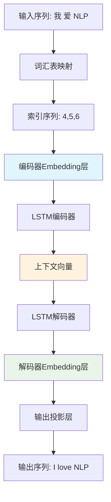

## 前言

在深度学习的浪潮中，embedding技术扮演着"语义桥梁"的关键角色，而LSTM序列到序列（Seq2Seq）模型则是处理变长序列任务的经典架构。本文将通过一个完整的中英机器翻译LSTM实现，深度剖析embedding在实际项目中的工作机制、训练过程和优化策略。

我们不仅会从理论层面理解embedding的本质，更会通过PyTorch代码的每一个细节，展示embedding如何在编码器-解码器架构中发挥作用，帮助你建立从概念到实践的完整认知体系。

## 1. 架构概览：Embedding在Seq2Seq中的战略地位

### 1.1 整体架构图



### 1.2 核心数据流分析

让我们通过实际代码追踪embedding的数据流转：

```python
# 第1步：文本预处理
src_sentence = "我 爱 自然 语言 处理"
src_indices = src_vocab.sentence_to_indices(src_sentence)  
# 结果：[4, 5, 6, 7, 8]

# 第2步：编码器embedding查表
embedded = encoder.embedding(input_seq)  # [1, 5, 64]
# 每个词索引被替换为64维稠密向量

# 第3步：LSTM处理embedding序列
context_vector, encoder_hidden = encoder.lstm(embedded)
# embedding向量序列 → 固定长度上下文向量

# 第4步：解码器embedding参与生成
decoder_embedded = decoder.embedding(decoder_input)
output = decoder.lstm(decoder_embedded, encoder_hidden)
# 目标语言词汇的embedding参与解码过程
```

## 2. 编码器中的Embedding：从离散到连续的语义映射

### 2.1 LSTMEncoder核心实现深度解析

```python
class LSTMEncoder(nn.Module):
    def __init__(self, vocab_size, embed_size, hidden_size, num_layers=1):
        super(LSTMEncoder, self).__init__()
        self.hidden_size = hidden_size
        self.num_layers = num_layers
        
        # 🔑 关键：词嵌入层 - 语义空间的入口
        self.embedding = nn.Embedding(vocab_size, embed_size, padding_idx=0)
        # LSTM层 - 序列建模核心
        self.lstm = nn.LSTM(embed_size, hidden_size, num_layers, 
                           batch_first=True, bidirectional=False)
```

### 2.2 Embedding初始化的数学原理

embedding层的初始化直接影响模型收敛速度和最终性能：

```python
# PyTorch默认初始化：N(0,1)标准正态分布
embedding.weight ~ N(0, 1)

# 实际项目中的改进初始化
def init_embedding_weights(embedding_layer, vocab_size, embed_size):
    """改进的embedding初始化策略"""
    # Xavier初始化：适合大多数激活函数
    std = np.sqrt(2.0 / (vocab_size + embed_size))
    embedding_layer.weight.data.normal_(0, std)
    
    # 特殊处理：padding token保持零向量
    if embedding_layer.padding_idx is not None:
        embedding_layer.weight.data[embedding_layer.padding_idx].fill_(0)
```

### 2.3 前向传播中的Embedding变换

```python
def forward(self, input_seq, input_lengths):
    # input_seq: [batch_size, seq_len] = [2, 5]
    # 输入示例：[[4, 5, 6, 7, 8], [9, 10, 0, 0, 0]]
    
    batch_size = input_seq.size(0)
    
    # 🔥 核心变换：离散索引 → 连续向量
    embedded = self.embedding(input_seq)  # [2, 5, 64]
    # 每个词被替换为64维稠密向量
    
    print(f"Embedding前: {input_seq.shape} - 离散索引")
    print(f"Embedding后: {embedded.shape} - 连续向量")
    
    # 序列打包：处理变长输入
    packed = nn.utils.rnn.pack_padded_sequence(
        embedded, input_lengths, batch_first=True, enforce_sorted=False)
    
    # LSTM处理embedding序列
    packed_output, (hidden, cell) = self.lstm(packed)
    
    # 上下文向量：整个输入序列的语义摘要
    context_vector = hidden[-1]  # [batch_size, hidden_size]
    
    return context_vector, (hidden, cell)
```

## 3. 解码器中的Embedding：生成过程的语义引导

### 3.1 自回归生成中的Embedding循环

```python
def _generate_sequence(self, encoder_hidden, max_length):
    """自回归生成过程中的embedding应用"""
    outputs = []
    hidden = encoder_hidden
    # 初始输入：
</rewritten_file>

## 完整代码实现

想要查看完整的LSTM编码器-解码器实现代码吗？我们为您准备了一个交互式的代码展示页面：

### 🔗 **[查看完整代码实现](/demos/lstm_encoder_decoder.html)**

这个专门设计的代码展示页面包含：

- **完整的276行PyTorch代码**：包含词汇表构建、LSTM编码器、解码器和训练流程
- **语法高亮显示**：使用现代化的代码主题，提供最佳的阅读体验  
- **一键复制功能**：轻松复制代码到您的项目中
- **直接下载选项**：可以直接下载Python文件到本地
- **项目概述信息**：包含运行要求、快速开始指南等
- **章节导航**：快速跳转到您感兴趣的代码部分

### 💡 使用建议

1. **学习路径**：先阅读本文的理论分析，再查看完整代码实现
2. **实践操作**：将代码下载到本地，尝试运行并修改参数
3. **深入研究**：基于这个基础实现，探索更高级的seq2seq变体

---

*希望这个完整的embedding理论与LSTM实践相结合的指南能够帮助您深入理解深度学习中的核心概念！*