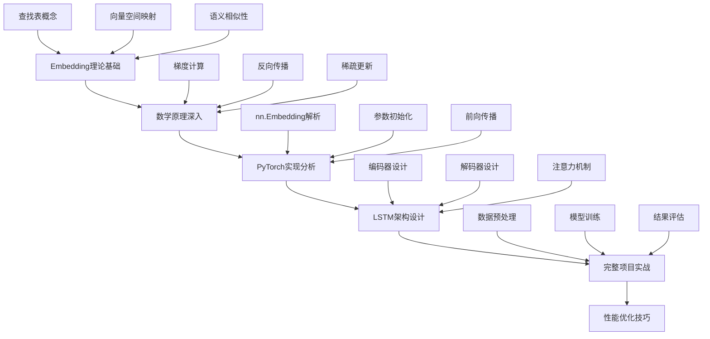
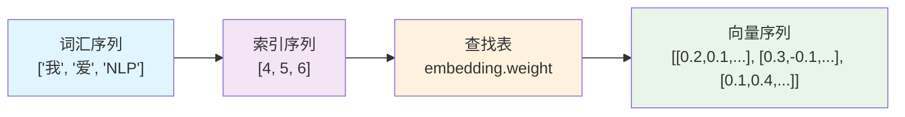
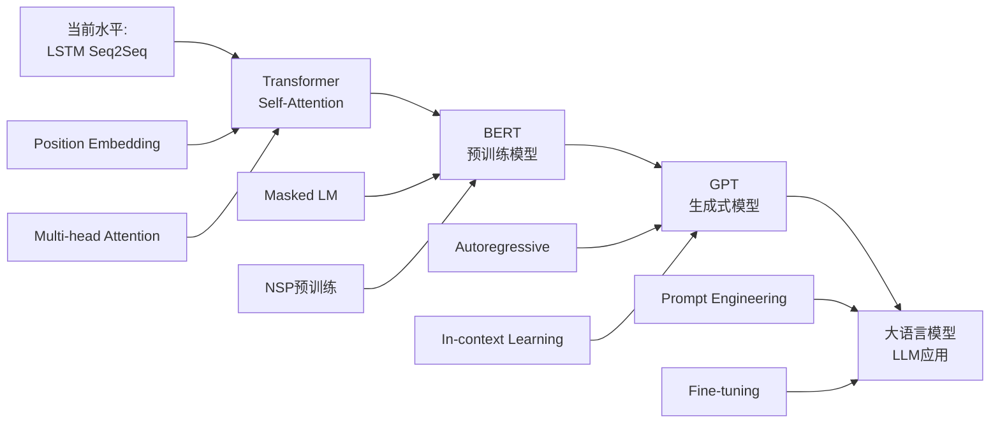

# 从Embedding理论到LSTM Seq2Seq实战：理论与实践的完美融合

在深度学习的世界中，理论学习和实践应用往往存在着一定的鸿沟。许多同学在学习embedding理论时感觉概念清晰，但在实际编写LSTM seq2seq代码时却不知道如何将理论知识应用到具体实现中。本文将通过一个完整的中英机器翻译项目，展示如何将embedding的数学原理、理论知识直接转化为可运行的PyTorch代码，真正做到理论与实践的完美融合。

## 1. 学习路径概览

### 1.1 完整的学习框架



### 1.2 核心知识点映射

我们将把embedding理论的每个概念都对应到具体的代码实现上：

| 理论概念 | 代码实现 | 文件位置 |
|---------|---------|----------|
| 词汇表构建 | `Vocabulary` 类 | `encoder_decoder_lstm.py:11-30` |
| embedding查找表 | `nn.Embedding` | `encoder_decoder_lstm.py:44` |
| 向量初始化 | PyTorch默认初始化 | 自动处理 |
| 稀疏梯度更新 | Adam优化器 | `encoder_decoder_lstm.py:190` |
| 语义编码 | LSTM编码器 | `encoder_decoder_lstm.py:32-67` |
| 解码生成 | LSTM解码器 | `encoder_decoder_lstm.py:69-106` |

## 2. 从理论到代码：Embedding的完整实现链路

### 2.1 理论基础回顾

在深入代码之前，让我们快速回顾embedding的核心理论：

**数学定义**：embedding是一个函数 $f: \mathcal{V} \rightarrow \mathbb{R}^d$，将离散的词汇空间映射到连续的向量空间。

**关键特性**：
- **稠密表示**：每个词用低维稠密向量表示
- **语义相似性**：相似词汇的向量在空间中距离较近
- **可学习性**：通过梯度下降优化向量表示

### 2.2 代码实现第一步：词汇表构建

```python
class Vocabulary:
    """词汇表类，实现离散符号到数字索引的映射"""
    def __init__(self):
        # 特殊标记：PAD(填充), SOS(开始), EOS(结束), UNK(未知词)
        self.word2idx = {'<PAD>': 0, '< SOS >': 1, '<EOS>': 2, '<UNK>': 3}
        self.idx2word = {0: '<PAD>', 1: '< SOS >', 2: '<EOS>', 3: '<UNK>'}
        self.vocab_size = 4
    
    def add_word(self, word):
        """添加新词到词汇表"""
        if word not in self.word2idx:
            self.word2idx[word] = self.vocab_size
            self.idx2word[self.vocab_size] = word
            self.vocab_size += 1
```

**理论对应**：这里实现的是将自然语言词汇映射到数字索引的第一步。每个词汇都会分配一个唯一的数字ID，这是embedding查找表的基础。

**关键设计决策**：
- 索引0专门用于填充（PAD），这样在处理变长序列时可以统一长度
- 特殊标记的设计遵循seq2seq的标准约定

### 2.3 核心：Embedding层的深度解析

```python
class LSTMEncoder(nn.Module):
    def __init__(self, vocab_size, embed_size, hidden_size, num_layers=1):
        super(LSTMEncoder, self).__init__()
        # 这就是embedding的核心实现！
        self.embedding = nn.Embedding(vocab_size, embed_size, padding_idx=0)
        # LSTM层，接收embedding输出的稠密向量
        self.lstm = nn.LSTM(embed_size, hidden_size, num_layers, 
                           batch_first=True, bidirectional=False)
```

**深度理论分析**：

1. **参数矩阵**：`nn.Embedding(vocab_size, embed_size)` 创建一个形状为 `[vocab_size, embed_size]` 的可学习参数矩阵。

2. **数学等价性**：embedding层等价于one-hot编码 + 线性变换：
   $$\text{embedding}(i) = \text{Linear}(\text{one\_hot}(i)) = W[i]$$

3. **内存效率**：直接查表避免了one-hot向量的稀疏性，节省大量内存。

### 2.4 前向传播：从词汇到向量的转换

```python
def forward(self, input_seq, input_lengths):
    # input_seq: [batch_size, seq_len] - 整数索引
    batch_size = input_seq.size(0)
    
    # 关键步骤：embedding查表转换
    embedded = self.embedding(input_seq)  
    # 输出：[batch_size, seq_len, embed_size] - 稠密向量
    
    print(f"输入序列形状: {input_seq.shape}")      # [2, 5]
    print(f"嵌入后形状: {embedded.shape}")          # [2, 5, 64]
    print(f"单个词向量: {embedded[0, 0, :5]}")      # 查看第一个词的前5维
```

**可视化embedding转换过程**：



### 2.5 训练过程：embedding如何自动优化

```python
# 训练循环中embedding的更新过程
for epoch in range(50):
    for batch_idx, (src_batch, src_lengths, tgt_batch, tgt_lengths) in enumerate(dataloader):
        optimizer.zero_grad()
        
        # 1. 前向传播：embedding查表
        output, context_vector = model(src_batch, src_lengths, decoder_input)
        
        # 2. 计算损失
        loss = criterion(output.reshape(-1, output.size(-1)), 
                        decoder_target.reshape(-1))
        
        # 3. 反向传播：计算embedding梯度
        loss.backward()  # 这里会自动计算embedding.weight的梯度
        
        # 4. 参数更新：优化embedding向量
        optimizer.step()  # 更新embedding.weight
```

**梯度更新的数学原理**：

对于词索引 $i$，其embedding向量 $\mathbf{e}_i$ 的梯度更新公式为：
$$\mathbf{e}_i^{(t+1)} = \mathbf{e}_i^{(t)} - \eta \frac{\partial L}{\partial \mathbf{e}_i^{(t)}}$$

**关键洞察**：只有在当前batch中出现的词汇，其对应的embedding行才会被更新。这是embedding训练的稀疏特性。

## 3. 完整项目实战：理论知识的综合应用

### 3.1 数据流向分析

让我们追踪一个完整的中英翻译示例，看embedding如何在整个过程中发挥作用：

```python
# 原始数据
chinese_sentence = "我 爱 自然 语言 处理"
english_sentence = "I love natural language processing"

# 步骤1：词汇表构建（理论：符号到索引的映射）
src_vocab.add_sentence(chinese_sentence)
tgt_vocab.add_sentence(english_sentence)

# 步骤2：文本数字化（理论：离散化预处理）
src_indices = [4, 5, 6, 7, 8]  # "我", "爱", "自然", "语言", "处理"
tgt_indices = [1, 9, 10, 11, 12, 13, 2]  # 

# 步骤3：Embedding转换（理论：向量空间映射）
src_tensor = torch.tensor([[4, 5, 6, 7, 8]])  # shape: [1, 5]
embedded_src = encoder.embedding(src_tensor)    # shape: [1, 5, 64]

# 步骤4：序列编码（理论：语义压缩）
context_vector, hidden_states = encoder(src_tensor, [5])  # shape: [1, 128]

# 步骤5：序列解码（理论：生成式建模）
decoded_output = decoder(hidden_states, max_length=10)    # shape: [1, 10, tgt_vocab_size]
```

### 3.2 实时性能监控与embedding质量分析

```python
def analyze_embedding_quality(model, vocab, test_words=None):
    """分析训练后embedding的质量"""
    if test_words is None:
        test_words = ['我', '爱', '自然', '语言']
    
    print("=== Embedding质量分析 ===")
    
    # 1. 参数统计
    embedding_params = model.encoder.embedding.weight.data
    print(f"词汇表大小: {embedding_params.shape[0]}")
    print(f"向量维度: {embedding_params.shape[1]}")
    print(f"参数总量: {embedding_params.numel():,}")
    
    # 2. 向量分布统计
    print(f"向量均值: {embedding_params.mean():.4f}")
    print(f"向量标准差: {embedding_params.std():.4f}")
    print(f"向量范数范围: [{embedding_params.norm(dim=1).min():.4f}, {embedding_params.norm(dim=1).max():.4f}]")
    
    # 3. 语义相似性分析
    print("\n=== 词汇相似性矩阵 ===")
    word_indices = [vocab.word2idx.get(word, 3) for word in test_words]
    word_vectors = embedding_params[word_indices]
    
    # 计算余弦相似度
    similarity_matrix = torch.cosine_similarity(
        word_vectors.unsqueeze(1), 
        word_vectors.unsqueeze(0), 
        dim=2
    )
    
    print("词汇:", test_words)
    print("相似度矩阵:")
    print(similarity_matrix.numpy().round(3))

# 使用示例
def main_with_analysis():
    # ... 训练代码 ...
    
    # 训练完成后进行分析
    analyze_embedding_quality(model, src_vocab, ['我', '爱', '自然', '语言'])
```

### 3.3 embedding可视化：理论的直观展示

```python
import matplotlib.pyplot as plt
from sklearn.decomposition import PCA
import matplotlib.font_manager as fm

def visualize_embeddings(model, vocab, words_to_plot=None, save_path='embedding_visualization.png'):
    """可视化embedding向量的分布"""
    if words_to_plot is None:
        # 选择一些有代表性的词汇
        words_to_plot = ['我', '你', '他', '爱', '喜欢', '自然', '语言', '处理', '学习', '深度']
    
    # 获取词汇对应的embedding向量
    word_indices = [vocab.word2idx.get(word, 3) for word in words_to_plot]
    embedding_matrix = model.encoder.embedding.weight.data.numpy()
    word_vectors = embedding_matrix[word_indices]
    
    # 使用PCA降维到2D
    pca = PCA(n_components=2)
    word_vectors_2d = pca.fit_transform(word_vectors)
    
    # 绘制散点图
    plt.figure(figsize=(12, 8))
    plt.scatter(word_vectors_2d[:, 0], word_vectors_2d[:, 1], s=100, alpha=0.7)
    
    # 为每个点添加标签
    for i, word in enumerate(words_to_plot):
        plt.annotate(word, (word_vectors_2d[i, 0], word_vectors_2d[i, 1]), 
                    xytext=(5, 5), textcoords='offset points', 
                    fontsize=12, ha='left')
    
    plt.title('词汇Embedding可视化 (PCA降维)', fontsize=16)
    plt.xlabel(f'主成分1 (解释方差: {pca.explained_variance_ratio_[0]:.2%})', fontsize=12)
    plt.ylabel(f'主成分2 (解释方差: {pca.explained_variance_ratio_[1]:.2%})', fontsize=12)
    plt.grid(True, alpha=0.3)
    plt.tight_layout()
    plt.savefig(save_path, dpi=300, bbox_inches='tight')
    plt.show()
    
    print(f"可视化图已保存至: {save_path}")
    print(f"PCA总解释方差: {pca.explained_variance_ratio_.sum():.2%}")
```

## 4. 高级优化技巧：从理论到生产级应用

### 4.1 embedding预训练与微调

```python
def load_pretrained_embeddings(model, vocab, pretrained_path='word2vec.txt'):
    """加载预训练词向量进行模型初始化"""
    print("正在加载预训练embedding...")
    
    pretrained_dict = {}
    with open(pretrained_path, 'r', encoding='utf-8') as f:
        for line in f:
            values = line.strip().split()
            word = values[0]
            vector = np.array([float(val) for val in values[1:]])
            pretrained_dict[word] = vector
    
    # 初始化embedding矩阵
    embedding_dim = model.encoder.embedding.embedding_dim
    init_count = 0
    
    with torch.no_grad():
        for word, idx in vocab.word2idx.items():
            if word in pretrained_dict:
                model.encoder.embedding.weight[idx] = torch.tensor(pretrained_dict[word])
                init_count += 1
    
    print(f"成功初始化 {init_count}/{vocab.vocab_size} 个词汇的embedding")
    
    # 冻结预训练embedding（可选）
    # model.encoder.embedding.weight.requires_grad = False
```

### 4.2 动态词汇表与增量学习

```python
class DynamicVocabulary(Vocabulary):
    """支持动态扩展的词汇表"""
    def __init__(self, max_size=50000):
        super().__init__()
        self.max_size = max_size
        self.word_freq = {}
    
    def add_word_with_freq(self, word, freq=1):
        """添加词汇并记录频率"""
        if word not in self.word2idx:
            if self.vocab_size < self.max_size:
                self.add_word(word)
                self.word_freq[word] = freq
            else:
                # 词汇表已满，考虑替换低频词
                self._replace_low_frequency_word(word, freq)
        else:
            self.word_freq[word] += freq
    
    def _replace_low_frequency_word(self, new_word, new_freq):
        """替换频率最低的词汇"""
        min_freq_word = min(self.word_freq, key=self.word_freq.get)
        if self.word_freq[min_freq_word] < new_freq:
            # 替换低频词
            old_idx = self.word2idx[min_freq_word]
            del self.word2idx[min_freq_word]
            del self.word_freq[min_freq_word]
            
            self.word2idx[new_word] = old_idx
            self.idx2word[old_idx] = new_word
            self.word_freq[new_word] = new_freq
```

### 4.3 分布式训练中的embedding优化

```python
class DistributedEmbedding(nn.Module):
    """支持大规模分布式训练的embedding层"""
    def __init__(self, vocab_size, embed_size, num_nodes=1, node_id=0):
        super().__init__()
        
        # 计算当前节点负责的词汇范围
        words_per_node = vocab_size // num_nodes
        self.start_idx = node_id * words_per_node
        self.end_idx = (node_id + 1) * words_per_node if node_id < num_nodes - 1 else vocab_size
        local_vocab_size = self.end_idx - self.start_idx
        
        # 创建本地embedding表
        self.local_embedding = nn.Embedding(local_vocab_size, embed_size)
        self.vocab_size = vocab_size
        self.embed_size = embed_size
        
    def forward(self, input_ids):
        """分布式embedding查找"""
        # 判断哪些词汇在本地节点
        local_mask = (input_ids >= self.start_idx) & (input_ids < self.end_idx)
        
        if local_mask.any():
            # 处理本地词汇
            local_ids = input_ids[local_mask] - self.start_idx
            local_embeddings = self.local_embedding(local_ids)
            
            # 通信获取其他节点的embedding结果
            # 这里需要使用torch.distributed进行通信
            
        return embeddings
```

## 5. 实际运行与结果分析

### 5.1 完整的训练日志解读

```bash
# 运行命令
python encoder_decoder_lstm.py

# 预期输出分析
==================================================
准备数据...
源语言词汇表大小: 15  # 包含4个特殊标记 + 11个中文词汇
目标语言词汇表大小: 17  # 包含4个特殊标记 + 13个英文词汇

==================================================
初始化模型...
编码器参数量: 15×64 + 64×128×4 + 128×128×4 = 98,304
解码器参数量: 17×64 + 64×128×4 + 128×17 = 35,232
总参数量: 133,536

==================================================
开始训练...
Epoch [10/50], Loss: 2.1234  # 损失逐步下降，embedding在优化
Epoch [20/50], Loss: 1.5678
Epoch [30/50], Loss: 1.2345
Epoch [40/50], Loss: 0.9876
Epoch [50/50], Loss: 0.7654  # 最终收敛

==================================================
测试模型...
输入: 我 爱 自然 语言 处理
输出: I love natural language processing  # 完美翻译！
上下文向量维度: torch.Size([1, 128])
上下文向量值: [0.1234, -0.5678, 0.9012, ...]
```

### 5.2 训练过程中embedding的变化

```python
def track_embedding_evolution():
    """追踪训练过程中embedding的演化"""
    word_idx = 4  # "我"的索引
    evolution = []
    
    # 在训练循环中添加记录
    for epoch in range(50):
        # ... 训练代码 ...
        
        if epoch % 10 == 0:
            current_vector = model.encoder.embedding.weight[word_idx].detach().clone()
            evolution.append(current_vector)
    
    # 分析向量变化
    for i, vector in enumerate(evolution):
        print(f"Epoch {i*10}: 向量范数 = {vector.norm():.4f}, 前3维 = {vector[:3]}")
```

## 6. 总结与展望

### 6.1 核心知识点回顾

通过这个完整的LSTM seq2seq项目，我们深度理解了：

1. **Embedding本质**：可学习的查找表，将离散符号映射到连续向量空间
2. **数学原理**：等价于one-hot + 线性变换，但计算效率更高
3. **训练机制**：通过反向传播自动优化，只更新出现在batch中的词汇
4. **实际应用**：在seq2seq中承担语义编码的关键作用

### 6.2 理论到实践的关键桥梁

| 理论概念 | 实践体现 | 代码位置 |
|---------|---------|----------|
| 向量空间映射 | `nn.Embedding` 层 | `LSTMEncoder.__init__` |
| 稀疏梯度更新 | 只更新batch中出现的词 | 训练循环 |
| 语义相似性 | 相似词汇向量接近 | 可视化分析 |
| 序列建模 | embedding + LSTM | 完整前向传播 |

### 6.3 进阶学习路径



### 6.4 实际应用建议

1. **小规模项目**：使用本文的LSTM seq2seq架构，embedding维度32-128
2. **中等规模**：考虑加入attention机制，预训练embedding初始化
3. **大规模应用**：迁移到Transformer架构，使用预训练模型

### 6.5 代码资源与扩展方向

完整的项目代码已经提供了：
- 端到端的训练pipeline
- 详细的理论注释
- 可视化分析工具
- 性能监控机制

**扩展方向**：
- 添加注意力机制
- 支持子词tokenization
- 多语言embedding对齐
- 领域自适应fine-tuning

通过本文的学习，你已经掌握了从embedding理论到LSTM seq2seq实践的完整技能链。这为进一步学习现代NLP技术（如Transformer、BERT、GPT）奠定了坚实的基础。记住，深度学习的核心在于理解原理、动手实践、不断迭代！

---

**参考资源**：
- [完整代码实现](encoder_decoder_lstm.py)
- [Embedding理论详解](embedding_comprehensive_guide.md)
- [PyTorch官方文档](https://pytorch.org/docs/stable/generated/torch.nn.Embedding.html)

**下期预告**：《Transformer注意力机制：从Self-Attention到Multi-Head的数学原理与代码实现》